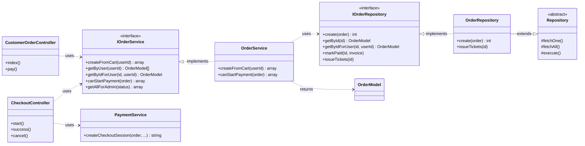
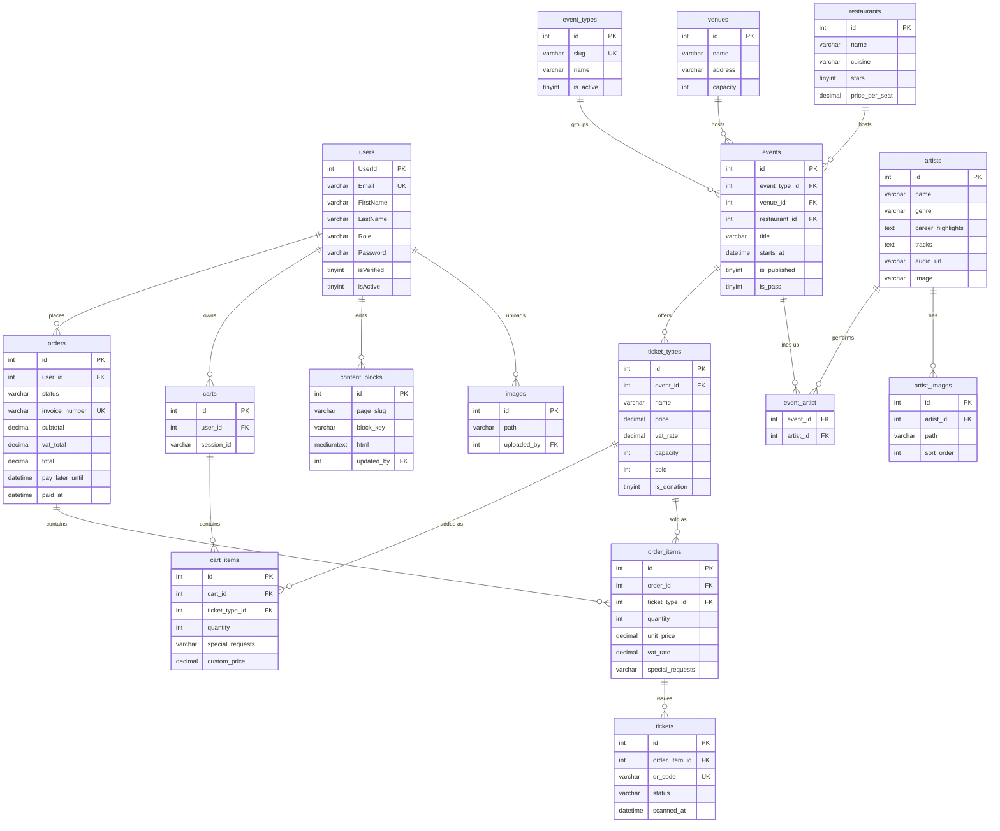
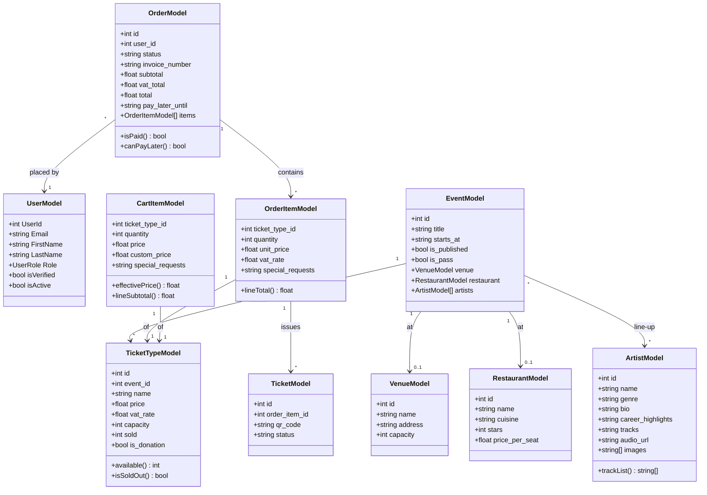

# Haarlem Festival — Technical Documentation

Ticketing website for The Festival (Inholland 2.3). Plain PHP MVC, MySQL, Docker,
Stripe (test) payment.

## 1. Architecture

Requests are routed to a **Controller**, which delegates to a **Service** (business
rules) that uses a **Repository** (data access). Every Service and Repository is
consumed through an **interface**, so the code is programmed against abstractions.
Repositories extend a base `Repository` wrapping PDO with prepared statements.
Cross-cutting: `AuthMiddleware` (auth, roles, CSRF), `View`, `Flash`, `Container`.

## 2. Database design

The schema is built by numbered, forward-only SQL **migrations**
(`database/migrate.php`). Money is `DECIMAL`; prices are VAT-inclusive and the VAT
portion is derived per line.

## 3. Domain model

Domain classes mirror the schema and carry small behaviours — e.g.
`TicketTypeModel::available()`, `CartItemModel::effectivePrice()` (donation /
HaarlemPas), `OrderModel::canPayLater()` (24-hour rule).

## 4. Key design decisions

- **Program against interfaces** — `IOrderService`, `IOrderRepository`, etc.
- **Migrations** — append-only, tracked, reproducible.
- **Passes as ticket types** — on a flagged `is_pass` event, reusing the whole flow.
- **Effective price** — donations and the HaarlemPas 25% both resolve to
  `cart_items.custom_price`, which becomes the order line `unit_price`.
- **Reservations** — EUR 10 per-person fee + special requests on the order line.
- **Pay later** — `pay_later_until = now + 24h`; retry re-validates deadline + stock.
- **Security & GDPR** — hashed passwords, CSRF on every POST, prepared statements,
  hardened session cookie, data export + anonymising erasure.
